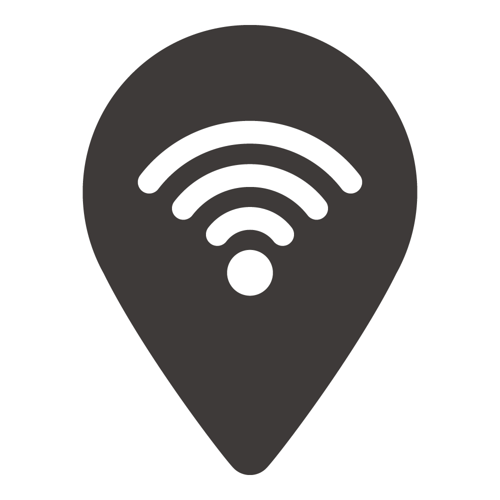

# 🧭 Coworker 

コワーキング/カフェのスポット投稿・検索ができるアプリ。  
マップで近くのスポットを見つけ、設備情報や写真を共有できます。

This is a Next.js-based web application for sharing and discovering coworking/cafe spots on a map.

- **Live App**: [https://coworker-pi.vercel.app](https://coworker-pi.vercel.app)
- **GitHub Repo**: [https://github.com/yony-1145/coworker](https://github.com/yony-1145/coworker)

---

## 🛠 技術スタック

- **Next.js**
- **React**
- **TypeScript**
- **Tailwind CSS**
- **Prisma**
- **PostgreSQL (Supabase)**
- **Supabase Storage**
- **NextAuth**
- **MapLibre**
- **Vercel**

---

## 🏗️ アーキテクチャ

**画像準備中**

---

## ✨ 主な機能

- ログイン（NextAuth）
- スポット投稿（画像/タグ/設備情報）
- マップで一覧・検索
- 位置情報のジオコーディング（Nominatim）
- ユーザープロフィール

---

## 📦 ディレクトリ構成（抜粋）

```
coworker/
├── src/
│   ├── app/              # Next.js のルーティング構成
│   ├── components/       # UI コンポーネント
│   ├── hooks/            # カスタムフック
│   ├── lib/              # 各種ロジック（認証、DB、API など）
├── prisma/               # Prisma スキーマとマイグレーション
├── public/
├── .env.example          # 環境変数の例
├── next.config.js
├── tailwind.config.ts
├── README.md
```

---

## ⚙️ 環境構築手順

1. **リポジトリをクローン**

```bash
git clone https://github.com/yony-1145/coworker.git
cd coworker
```

2. **依存パッケージのインストール**

```bash
pnpm install
```

3. **環境変数ファイルの作成**

`.env.local` をプロジェクトルートに作成し、以下を設定してください。

```env
DATABASE_URL=
NEXTAUTH_URL=
NEXTAUTH_SECRET=
NEXT_PUBLIC_SUPABASE_URL=
NEXT_PUBLIC_SUPABASE_ANON_KEY=
SUPABASE_SERVICE_ROLE_KEY=
GEOCODE_USER_AGENT=
```

4. **開発サーバーを起動**

```bash
pnpm dev
```

---

## 🛠 今後の開発予定

- [ ] 検索・フィルタ機能の強化
- [ ] 画像最適化と表示パフォーマンス改善

---

コワーキング環境選びの体験を良くするためのプロダクトです。ぜひご活用ください！
